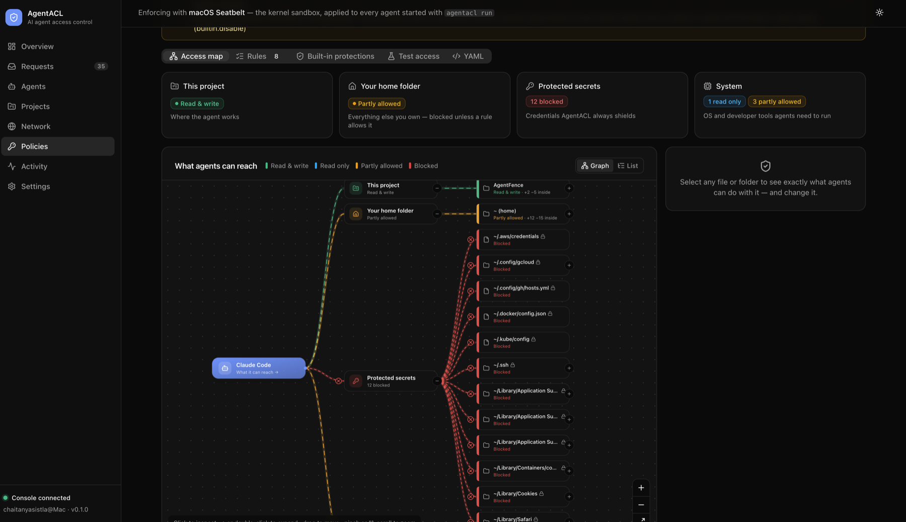
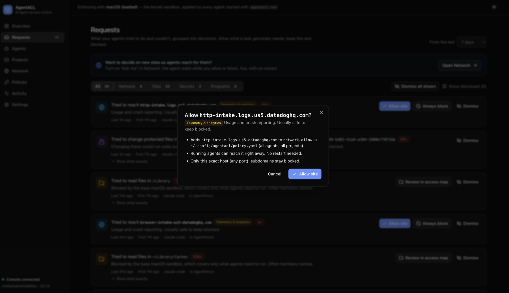
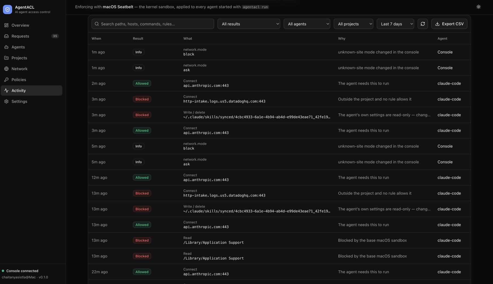

# AgentACL: access control and sandboxing for AI coding agents on macOS

**Stop Claude Code, Codex, Gemini CLI, Copilot CLI and OpenCode from reading
your secrets. AgentACL enforces it in the macOS kernel, not in the prompt.**

[](https://github.com/chaitanya-sistla/agentacl/actions/workflows/ci.yml)
[](https://github.com/chaitanya-sistla/agentacl/releases/latest)
[](LICENSE)


AI coding agents run shell commands **as you**. Anything you can read, they
can read: SSH keys, `.env` files, AWS and GCP credentials, Terraform state,
browser cookies. They can also send it anywhere on the internet.

AgentACL is an open-source **security layer for AI coding agents**. It runs
each agent inside a macOS kernel sandbox (Seatbelt), with a network egress
firewall and an audit log. The agent keeps full access to your project and
loses access to everything it shouldn't touch. You decide what that is, in a
local web console or a YAML policy.



## Why AgentACL

| | Without AgentACL | With AgentACL |
|---|---|---|
| Agent reads `~/.ssh`, `~/.aws`, `.env`, browser cookies | ✅ succeeds | ⛔ `Operation not permitted` (kernel) |
| Agent uploads data to an unknown site | ✅ succeeds | ⛔ refused by the egress proxy, or held until you approve |
| Agent plants a git hook or edits `~/.zshrc` | ✅ succeeds | ⛔ blocked |
| Subprocesses (`sh`, `python`, `curl`) | inherit everything | inherit the same sandbox |
| You know what the agent tried | no record | every attempt logged: agent, process chain, rule |
| An agent runs unprotected | invisible | flagged in the console |

Instructions like "don't read secrets" and an agent's own settings are not a
security boundary: a prompt injection in a README, an issue or a dependency
can override them. AgentACL's boundary is outside the agent, in the kernel.

**Supported agents:** Claude Code, OpenAI Codex CLI, Gemini CLI, GitHub Copilot
CLI, OpenCode, and any other command-line program.

## See it work

```console
$ agentacl run -- claude
> cat .env
cat: .env: Operation not permitted

AgentACL session agt_01M3R5TD4JXJNHSNNFS45QM0BK ended (exit 0)
  Blocked by policy: 1    Blocked by sandbox default: 0    Observed (not blocked): 0
  BLOCKED   filesystem.read  /Users/you/src/app/.env (protect-secrets/env-files)

$ agentacl policy check --path ~/.ssh/id_ed25519
Decision:  DENY
Policy:    protect-secrets (ssh)
Reason:    SSH keys and configuration are protected
```

### A real Claude Code session


Claude Code's first read of `rustfmt.toml` is refused by the kernel
(`Operation not permitted`). Claude says so plainly and doesn't try to switch
the sandbox off: there is nothing inside the sandbox it can switch. Once the
rules allow the file, the same conversation reads it.

## The console

`agentacl ui` opens a local web console (127.0.0.1 only) covering every agent
on the machine.

| **Overview:** what was blocked, by hour and by kind; top sites and files | **Requests:** everything agents tried and couldn't, as decisions |
|---|---|
|  |  |
| **Network:** every site agents reach; allow or block live, or set unknown sites to *Ask me* | **One-click rules:** each change says what is saved where and what happens to running agents |
|  |  |
| **Agents:** protected or not, rules up to date, restart or stop | **Activity:** the full audit log, with filters and CSV export |
|  |  |

With Network set to *Ask me*, an agent reaching a new site waits while you
allow or block it in the console, with a desktop notification. The decision
applies at once, with no restart.

## Install

```sh
V=0.2.0
curl -LO https://github.com/chaitanya-sistla/agentacl/releases/download/v$V/agentacl-$V-macos-universal.tar.gz
curl -LO https://github.com/chaitanya-sistla/agentacl/releases/download/v$V/SHA256SUMS
shasum -a 256 -c SHA256SUMS --ignore-missing     # OK
tar xzf agentacl-$V-macos-universal.tar.gz
sudo install -m 755 agentacl-$V-macos-universal/agentacl /usr/local/bin/
```

Every release is built by GitHub Actions from a tagged commit, with checksums
and a build-provenance attestation (`gh attestation verify <file> -R chaitanya-sistla/agentacl`).
From source: `cargo install --locked --git https://github.com/chaitanya-sistla/agentacl agentacl-cli`.

## Use

```sh
agentacl discover          # which AI agents are installed and running
agentacl run -- claude     # run any agent protected (codex, gemini, copilot, opencode…)
agentacl ui                # open the console
```

To always start an agent protected: `alias claude="agentacl run -- claude"`.

**Protected by default:**
- `.env*`, `~/.ssh`, and AWS, GCP, Azure and Kubernetes credentials;
- Terraform state, git and package-registry tokens, private keys and GPG;
- browser cookies and saved passwords;
- git hooks and shell startup files;
- secret environment variables (`*_TOKEN`, `AWS_*`, …).

You change the rules in the console or in `~/.config/agentacl/policy.yaml`.

## FAQ

### How do I stop Claude Code from reading my `.env` file?

Start it with `agentacl run -- claude`. `.env` files are blocked by default,
anywhere, and the block is enforced by the kernel for Claude Code and every
command it runs.

### Does AgentACL work with Codex, Gemini CLI, Copilot CLI and OpenCode?

Yes. `agentacl run -- <command>` works with any command-line agent, and
`agentacl discover` finds all five, installed or running.

### How is this different from the agent's own sandbox or permission prompts?

Those live inside the agent and are configured by the same files and prompts
an attacker can influence. AgentACL sits outside: the agent can't change
or turn off its rules.

### Can I control which websites an agent can reach?

Yes. All agent traffic goes through AgentACL's proxy. The Network page lists
every site with allowed and blocked counts, and blocks apply to running agents
immediately. In *Ask me* mode, you approve new sites as the agent reaches for
them.

### Does it send anything to the cloud?

No. Rules, the audit log and the console are all local to your Mac.

### Does it need root or a kernel extension?

No. It uses macOS's built-in sandbox, as your user.

### What isn't enforced yet?

Argument-level rules such as `git push *`, and agents started without
`agentacl run`, are observed but not blocked. The [guide](docs/guide.md)
lists every guarantee and limitation.

## Learn more

- [Guide](docs/guide.md): guarantees, commands, policy, limitations
- [Policy language](docs/policy-model.md)
- [Threat model](docs/threat-model.md)
- [macOS enforcement](docs/macos-enforcement.md)
- [Changelog](CHANGELOG.md) · [Releasing](docs/releasing.md)

## Contributing

Issues and pull requests are welcome: see [CONTRIBUTING.md](CONTRIBUTING.md).
Report security issues privately ([SECURITY.md](SECURITY.md)).

Built and maintained by Chaitanya Sistla · [Apache-2.0](LICENSE)
