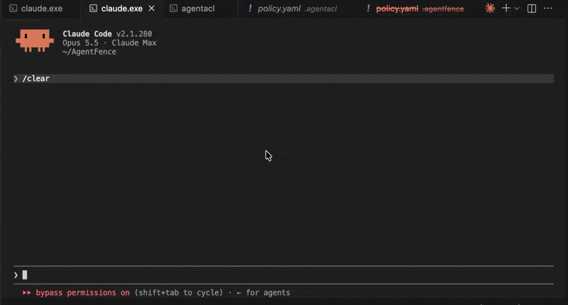
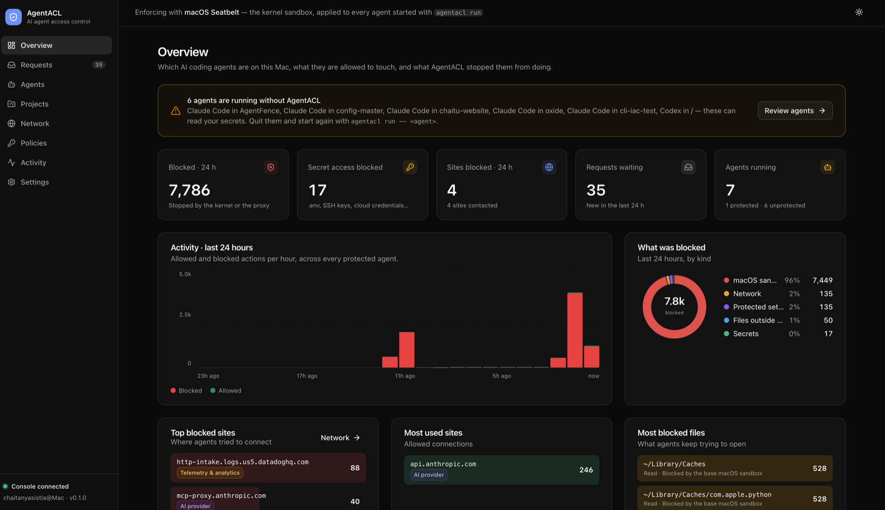
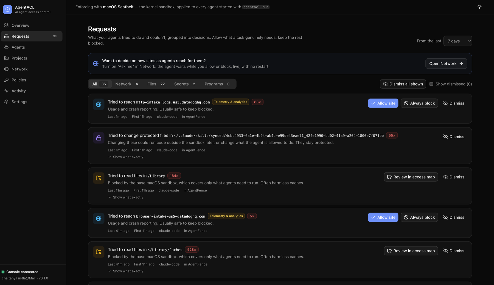
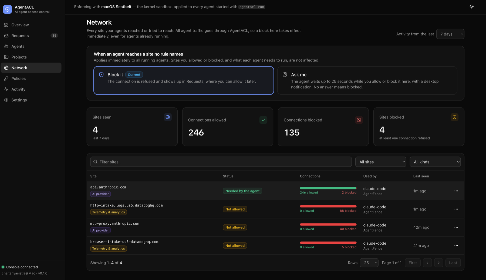
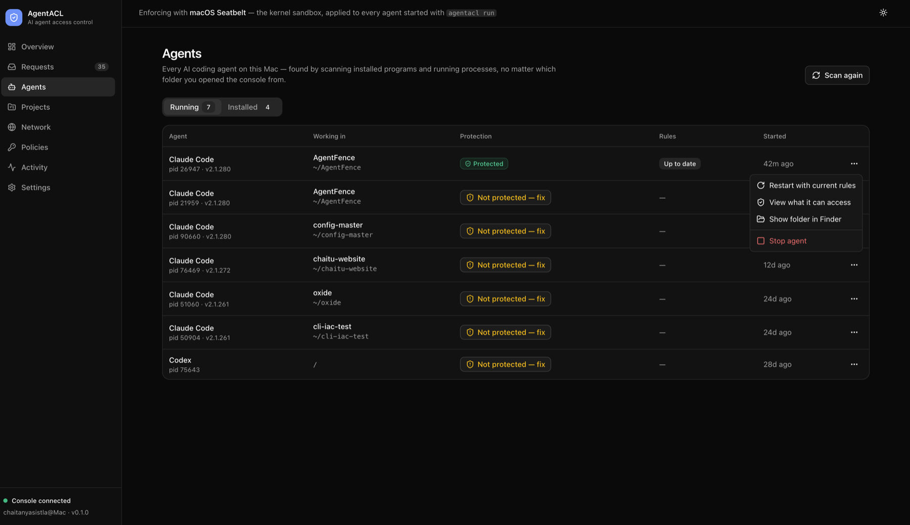
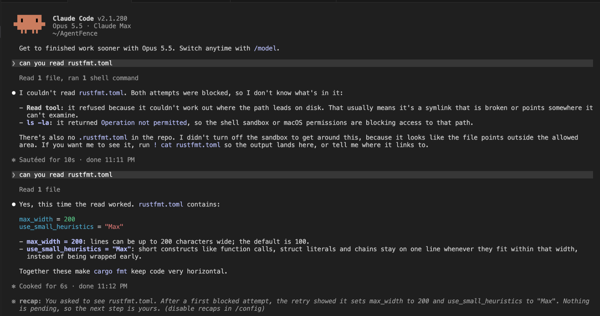

# AgentACL

**Claude has your permissions. We gave Claude its own.**

OS-level permissions for AI coding agents on macOS. Start Claude Code, Codex or
another agent with `agentacl run` and it runs inside a kernel sandbox: it and
every process it starts can't read your secrets, change files outside the
project (and temp directories) or reach networks you haven't approved.

[](https://github.com/chaitanya-sistla/agentacl/actions/workflows/ci.yml)
[](https://github.com/chaitanya-sistla/agentacl/releases/latest)
[](LICENSE)


```text
Claude Code
 └─ bash
     └─ python3 -c "open('/Users/you/.aws/credentials').read()"
          → PermissionError: [Errno 1] Operation not permitted
            (refused by the macOS kernel sandbox, not by the agent)
```

Not a prompt. Not a hook. Not an MCP rule. For an agent started with
`agentacl run`, the operating system refuses the read, for the agent and for
every child process it spawns.



*Same request, two sessions: plain `claude` reads the (dummy) credentials;
under `agentacl run`, the kernel refuses it, and asking again doesn't help.*

## Why

An AI coding agent runs as **you**: same Unix user, same permissions. Anything
you can read, it can read (SSH keys, `.env` files, cloud credentials, browser
cookies), and anything you can reach on the network, it can reach.

The agent's own permission settings, `CLAUDE.md` instructions and tool hooks
all live **inside** the agent's world. They are useful, but a prompt
injection in a README, an issue or a dependency can talk its way around
them. AgentACL puts the boundary **outside** the agent, in the macOS kernel,
where the agent can't change it.

## Quick start

With Homebrew:

```sh
brew install chaitanya-sistla/agentacl/agentacl
```

Or from the release, checked against its published checksum:

```sh
V=0.4.0
curl -LO https://github.com/chaitanya-sistla/agentacl/releases/download/v$V/agentacl-$V-macos-universal.tar.gz
curl -LO https://github.com/chaitanya-sistla/agentacl/releases/download/v$V/SHA256SUMS
shasum -a 256 -c SHA256SUMS --ignore-missing     # must print: OK
tar xzf agentacl-$V-macos-universal.tar.gz
sudo install -m 755 agentacl-$V-macos-universal/agentacl /usr/local/bin/

cd ~/src/your-project
agentacl run -- claude        # or codex, gemini, opencode, any command
```

Homebrew needs up-to-date Command Line Tools (Software Update) to install
from a tap. Releases are built by GitHub Actions from a tagged commit, with
checksums and a [build-provenance attestation](https://docs.github.com/en/actions/security-for-github-actions/using-artifact-attestations).
From source: `cargo install --locked --git https://github.com/chaitanya-sistla/agentacl agentacl-cli`.

To always start an agent protected: `alias claude="agentacl run -- claude"`.

To see what an agent could reach on your Mac, and what to fix first:

```sh
agentacl audit                 # or the console's Agents page
```

It checks credential files, cloud drives, company data services (Google
Drive, Dropbox, Microsoft 365, Slack, Notion, GitHub, S3 and more), MCP
servers and tokens written into their configs, and keychain access, and
gives the fix for each problem. It shows names only, never a secret value.

**Claude Code: use a token, not `/login`.** A `/login` login lives in the
macOS keychain, so AgentACL has to let the session reach the keychain, and
from there it can pull other saved credentials (see
[Limitations](#limitations)). With a token, the session gets no keychain
access at all:

```sh
claude setup-token                          # once; prints a long-lived token
export CLAUDE_CODE_OAUTH_TOKEN=<the token>  # e.g. in ~/.zshrc
agentacl run -- claude
```

## What gets protected by default

- `.env` files (anywhere), `~/.ssh`, AWS, GCP, Azure and Kubernetes credentials
- Terraform state and credentials, git and package-registry tokens, private
  keys, GPG keys
- browser cookies and saved passwords
- synced cloud drives: Google Drive, OneDrive, Dropbox, Box and iCloud
  (a project that lives inside one stays usable; iCloud's "Desktop &
  Documents" sync isn't covered, and `agentacl audit` tells you if it's on)
- git hooks and config, shell startup files, LaunchAgents, agent and editor
  configs, Python caches and user packages: the usual places to plant code
  that runs later, outside the sandbox (build files such as `package.json`
  are flagged for review instead, since the agent must edit them)
- secret environment variables (`*_TOKEN`, `AWS_*`, …), which are withheld
- all network egress except through AgentACL's proxy, which blocks sites no
  rule allows
- other apps' data reached *through* system services that run outside the
  sandbox (a "confused deputy"): another app's preferences, the live system
  log, other processes' shared memory, launchd jobs, Apple Events and the
  clipboard are all refused, each tested against a control that works
  outside the sandbox

Your project stays readable and writable. Change the rules in the console
(`agentacl ui`) or in `~/.config/agentacl/policy.yaml`.

## What AgentACL actually enforces

Short version:
- **Enforced** by the kernel or the proxy, with tests: everything above,
  for agents started with `agentacl run` and all their child processes,
  except as noted here.
- **Partly enforced**: planting code. Writing hooks, configs and caches in
  place is blocked, but a folder built elsewhere and moved into the project
  is not checked. Build files are flagged, not blocked.
- **Not protected**: keychain items, for Claude Code logged in with
  `/login` (use a token instead, see Quick start).
- **Observed, not blocked**:
  - agents started without `agentacl run`;
  - argument-level rules like `git push *`.
- **Planned**:
  - system-wide enforcement for any agent, however it was launched (Endpoint
    Security);
  - allow-once approvals for files.

The full matrix, with the test behind every "enforced", is in
**[docs/security-guarantees.md](docs/security-guarantees.md)**. If anything
here reads stronger than that file, the file is right.

## How it works

```text
agentacl run -- claude
  │
  ├─ policy: built-ins → your rules → project rules (restrict-only)
  │     compiled to a Seatbelt (SBPL) profile, deny rules last
  │
  ├─ sandbox-exec  ──►  claude  ──►  bash  ──►  python  …   (kernel sandbox, inherited)
  │
  ├─ network: only 127.0.0.1:<proxy> is reachable ──► AgentACL proxy ──► allowed sites
  │
  └─ audit: kernel denials + proxy decisions → local SQLite log, console, `agentacl events`
```

The enforcement mechanism is macOS Seatbelt, the same kernel sandbox Apple
ships and major agent vendors use. AgentACL didn't invent it: it turns a
readable policy into a Seatbelt profile, adds a network proxy, and records
what was blocked. Details: [macOS enforcement](docs/macos-enforcement.md),
[threat model](docs/threat-model.md).

## The console

`agentacl ui` opens a local web console (127.0.0.1 only) for every agent on
the machine.

| **Overview:** what was blocked, by hour and by kind; top sites and files | **Requests:** everything agents tried and couldn't, as decisions |
|---|---|
|  |  |
| **Network:** allow or block sites live, or set unknown sites to *Ask me* | **Agents:** protected or not, restart or stop |
|  |  |

With Network set to *Ask me*, an agent reaching a new site waits while you
allow or block it (30 seconds by default, up to 5 minutes, plus "+1 min").
Files can't wait: the kernel refuses them at once. They show up as requests:
**Allow…** grants exactly the files that were refused (not the whole folder,
unless you choose it), for one agent and one project, and applies with a
restart (the
conversation resumes). Notifications come at most once a minute, as a
digest, and can be silenced.

## A real Claude Code session



Claude's first read of `rustfmt.toml` is refused by the kernel. It says so
and doesn't try to switch the sandbox off: nothing inside the sandbox can.
Once the rules allow the file, the same conversation reads it.

## Supported agents

| Agent | Discovery | Supervised with `agentacl run` |
|---|---|---|
| Claude Code | ✅ by code signature | ✅ verified by the maintainer (login, network, blocks) |
| OpenAI Codex CLI | ✅ by code signature | ⚠️ launch settings provided (turns off Codex's own nested sandbox); not yet verified end to end |
| Gemini CLI, GitHub Copilot CLI, OpenCode | ✅ by install path | ⚠️ generic launch; not yet verified end to end |
| Any other command-line program | n/a | ✅ generic (the test suite runs shells, Python and git this way) |

Verified it with another agent? Please [open an issue](https://github.com/chaitanya-sistla/agentacl/issues/new/choose) so we can update this table.

## Agent identity: where this is going

Humans have identities. Machines and workloads have identities. AI agents
act on our behalf but borrow ours. AgentACL's longer-term aim is identity and
access control for agents running on your machine:

```text
Human → Machine → Agent → Agent session → Delegated processes → Resources
you     your Mac   Claude   agt_…          bash → terraform       AWS
```

The goal is authorization that considers **why** a process exists, not only
which binary runs: you running `terraform apply` and Claude causing
`terraform apply` can deserve different answers. Today AgentACL records the
agent, the session and a best-effort delegation chain on every event;
enforcement is by the sandbox, not by the chain.

## Limitations

- Protection applies to agents started with `agentacl run`. Agents started
  any other way are discovered and flagged, not blocked.
- A policy change applies to running agents on restart (the conversation
  resumes). Network decisions from the console apply live.
- Rules with arguments (`git push *`) are observed, not blocked.
- A copied or renamed binary dodges a program block by name.
- Seatbelt (`sandbox-exec`) is deprecated by Apple, though still shipped and
  widely used.
- Data sent to a site you allowed isn't inspected.
- **Keychain, for Claude Code logged in with `/login`.** Claude keeps that
  login in the macOS keychain, so the session can reach the keychain. It can
  then also run the credential helpers other items trust: git's returns
  saved GitHub tokens without asking (verified with
  `scripts/probes/keychain-deputy.sh`). It can also read the encrypted
  keychain database file. To close this, set `CLAUDE_CODE_OAUTH_TOKEN` (from
  `claude setup-token`) or `ANTHROPIC_API_KEY` in the shell you run
  `agentacl run` from: the session then gets no keychain access at all.
- Tested on macOS 14 and 15 on Apple Silicon. Intel binaries are built but
  not run in CI.
- Binaries are not yet notarized; macOS may warn on first run.

Full list: [security-guarantees.md](docs/security-guarantees.md) and the
[threat model](docs/threat-model.md).

## Roadmap

- Homebrew bottles, so `brew install` doesn't need Command Line Tools, and
  a formula that updates itself on each release
- AgentBreak: reproducible, vendor-neutral security tests for local AI-agent
  boundaries, with machine-readable results
- Endpoint Security backend: file and program rules for agents however they
  were started, argument-aware program rules, grants without a restart.
  Built (`agentacl-esd`), not yet verified on a development Mac; shipping
  needs Apple's entitlement ([design](docs/design/endpoint-security.md))
- Signed and notarized releases

## FAQ

### How do I stop Claude Code from reading my `.env` file?

Start it with `agentacl run -- claude`. `.env` files are blocked by default,
anywhere, for Claude Code and every command it runs.

### Can an agent ask another app to do what the sandbox won't let it?

That's a "confused deputy", and it's the main way sandboxes leak. Every
system service a session can reach was probed for real: reading another
app's preferences, streaming the system log, reading other processes'
shared memory, scheduling a launchd job, scripting other apps and using the
clipboard are all refused, and each has a regression test. The one open
case is the keychain for Claude Code's `/login` (see Limitations). Found
another? Please report it privately via [SECURITY.md](SECURITY.md).

### Does it send anything to the cloud?

No. Rules, the audit log and the console are local to your Mac. No
authorization decision uses a language model.

### Does it need root or a kernel extension?

No. It uses macOS's built-in sandbox, as your user.

## Contributing

Issues, security research and pull requests are welcome: start with
[CONTRIBUTING.md](CONTRIBUTING.md). Try to break the threat model; if you do,
please report it privately via [SECURITY.md](SECURITY.md).

More docs: [guide](docs/guide.md) · [policy language](docs/policy-model.md) ·
[current state](docs/current-state.md) · [changelog](CHANGELOG.md)

Built and maintained by Chaitanya Sistla · [Apache-2.0](LICENSE)
