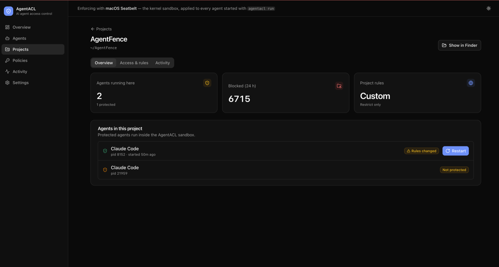

# AgentACL

**Your AI coding agent can read your SSH keys. AgentACL stops it — in the kernel.**

[](https://github.com/chaitanya-sistla/agentacl/actions/workflows/ci.yml)
[](https://github.com/chaitanya-sistla/agentacl/releases/latest)
[](LICENSE)


Claude Code, Codex, Gemini CLI, Copilot CLI and OpenCode run shell commands
**as you**, so anything you can read, they can read and send anywhere.
AgentACL runs them inside a macOS kernel sandbox with rules you control.
Your project stays open; your secrets don't.


## Why

| | Without AgentACL | With AgentACL |
|---|---|---|
| Agent reads `~/.ssh`, `~/.aws`, `.env`, browser cookies | ✅ succeeds | ⛔ `Operation not permitted` (kernel) |
| Agent uploads to an unknown host | ✅ succeeds | ⛔ refused by the egress proxy |
| Agent plants a git hook or edits `~/.zshrc` | ✅ succeeds | ⛔ blocked |
| Subprocesses (`sh`, `python`, `curl`) | inherit everything | inherit the same sandbox |
| You know what happened | ❌ | ✅ every block logged: agent, process chain, rule |
| An agent runs unprotected | invisible | flagged |

The boundary lives in the kernel, outside the agent: a prompt injection can't
talk its way past it.

## CLI

```console
$ agentacl run -- claude
> cat .env
cat: .env: Operation not permitted

AgentACL session agt_01M3R5TD4JXJNHSNNFS45QM0BK ended (exit 0)
  Blocked by policy: 1    Blocked by sandbox default: 0    Observed (not blocked): 0
  BLOCKED   filesystem.read  /Users/you/src/app/.env (protect-secrets/env-files)

$ agentacl policy check --path ~/.ssh/id_ed25519
Decision:  DENY
Policy:    protect-secrets (ssh)
Reason:    SSH keys and configuration are protected
```

## Console

`agentacl ui` opens a local console (127.0.0.1 only). It shows every agent on
the machine, what each one can reach, and what was blocked. Review a rule
change, save it, and restart affected agents in one click.

| Overview | Agents |
|---|---|
|  |  |
| **Activity (audit log)** | **Project** |
|  |  |

## Install

```sh
V=0.1.0
curl -LO https://github.com/chaitanya-sistla/agentacl/releases/download/v$V/agentacl-$V-macos-universal.tar.gz
curl -LO https://github.com/chaitanya-sistla/agentacl/releases/download/v$V/SHA256SUMS
shasum -a 256 -c SHA256SUMS --ignore-missing     # OK
tar xzf agentacl-$V-macos-universal.tar.gz
sudo install -m 755 agentacl-$V-macos-universal/agentacl /usr/local/bin/
```

Every release is built by GitHub Actions from a tagged commit, with checksums
and a build-provenance attestation (`gh attestation verify <file> -R chaitanya-sistla/agentacl`).
From source: `cargo install --locked --git https://github.com/chaitanya-sistla/agentacl agentacl-cli`.

## Use

```sh
agentacl discover          # which agents are installed and running
agentacl run -- claude     # run any agent protected (codex, gemini, copilot, opencode…)
agentacl ui                # console
```

**Protected by default:**
- `.env*`, `~/.ssh`, and AWS, GCP, Azure and Kubernetes credentials;
- Terraform state, git and package-registry tokens, private keys and GPG;
- browser cookies and saved passwords;
- git hooks and shell startup files;
- secret environment variables.

You change the rules in the console or in `~/.config/agentacl/policy.yaml`.

## Learn more

- [Guide](docs/guide.md): guarantees, commands, policy, limitations
- [Policy language](docs/policy-model.md)
- [Threat model](docs/threat-model.md)
- [macOS enforcement](docs/macos-enforcement.md)
- [Releasing](docs/releasing.md)

Built and maintained by Chaitanya Sistla · [Apache-2.0](LICENSE)
